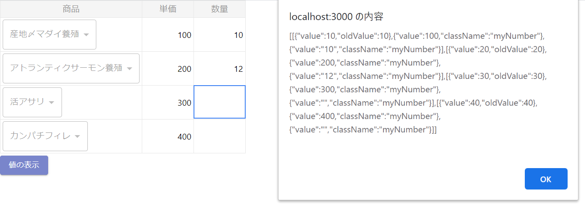

# sample-iddan-react-spreadsheet

## インストール

```
> yarn add react-spreadsheet
> yarn add @material-ui/core
```

## GitHub

https://github.com/iddan/react-spreadsheet

## 画面イメージ



## 動作説明

- 「値の表示」ボタン押下で、現在のスプレッドのデータが表示される
- 商品SELECTを変更して、その行の単価にフォーカスを当てると、商品に対する単価が自動セットされる

## 問題点＆課題

- 変更のあったセルの位置を簡単に取得できない（当サンプルでは oldValue を使って実現している）
- 上記の動作説明にもあるように、ロジックでスプレッドの値を変更した場合、そのセルにフォーカスを当てないと、値がかわっていないように見える
- ドキュメントやサンプルが少ない（皆無に近い）ので、ライブラリのソースコードを追わないといけない
